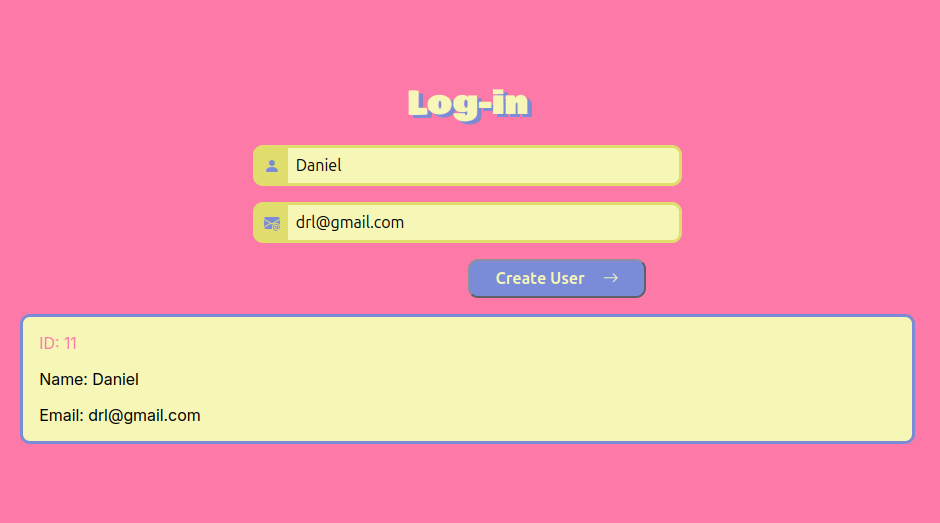

# POST - Create User


Proyecto desarrollado para practicar el consumo de APIs mediante el método HTTP `POST` utilizando JavaScript y la función `fetch()`.

La aplicación permite introducir un nombre y un email para enviar los datos a una API y simular la creación de un usuario.

## Tecnologías

* HTML5
* CSS3
* JavaScript
* Fetch API
* JSONPlaceholder

## Funcionamiento

El usuario introduce su nombre y email y pulsa **Create User**.

Los datos se convierten a JSON y se envían mediante una petición `POST`:

```text
https://jsonplaceholder.typicode.com/users
```

Ejemplo del cuerpo enviado:

```json
{
  "name": "John Doe",
  "email": "john@example.com"
}
```

Si la petición es correcta, la API devuelve los datos del usuario junto con un ID generado, que se muestran en la interfaz.


## Estructura

```text
post-user/
├── index.html
├── css/
│   └── style.css
└── js/
    └── main.js
```

## Ejecución

Clona el repositorio y abre `index.html` en el navegador. También puedes utilizar **Live Server** desde Visual Studio Code.

## API

El proyecto utiliza [JSONPlaceholder](https://jsonplaceholder.typicode.com/), una API REST de prueba para practicar peticiones HTTP.

> Nota: JSONPlaceholder simula la creación del usuario. Los datos no se almacenan realmente en un servidor persistente.
